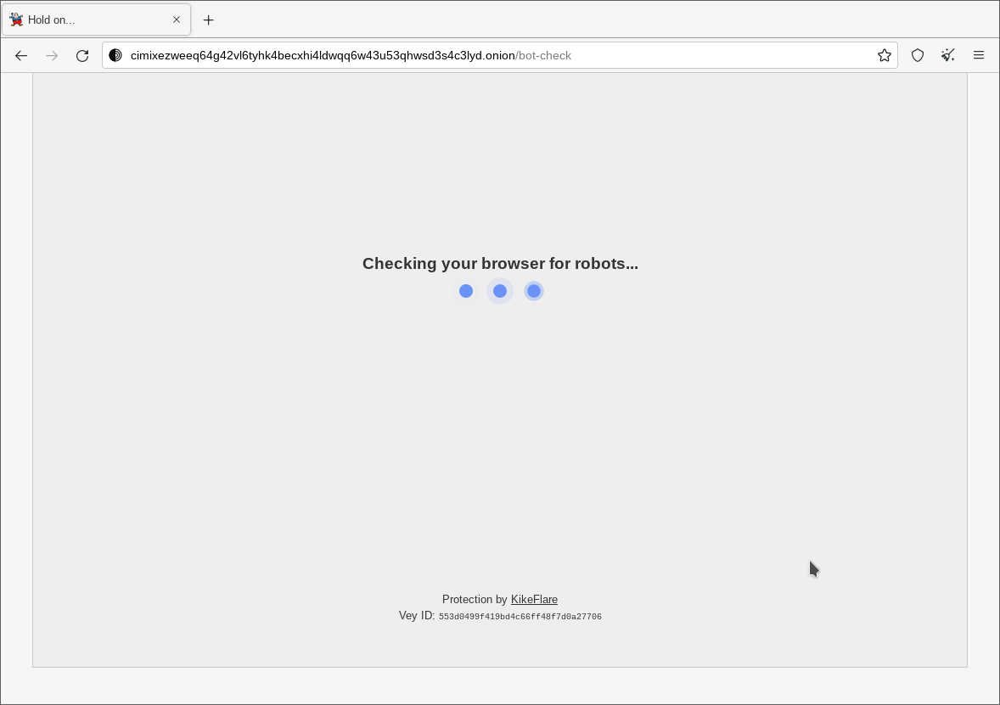

## HAProxy DDoS protection system

A fork and further development of a proof of concept from https://github.com/mora9715/haproxy_ddos_protector, a HAProxy configuration and lua scripts allowing a challenge-response page where users solve a captcha and/or proof-of-work.
Intended to stop bots, spam, ddos, etc.

Will soon™ be accompanied by a control panel allowing to manage clusters of servers with this installed. Allowing you to add/remove/edit domains, protection rules, blocked ips, backend server IPs, etc during runtime.

Improvements in this fork:

- Add a proof-of-work element, instead of only captcha.
- Add examples and support for .onion/tor using the HAProxy PROXY protocol to provide some kind of "ip" discrimination of tor users (circuit identifiers).
- Use HAProxy http-request return to improve performance/caching for the challenge page, without an extra backend http server.
- Improved the appearance of the challenge page.
- Remove dns resolution hack, use proper backend address.
- Fix multiple security issues that could result in bypassing the captcha.
- Add a bucket duration for cookie validity, so valid cookies don't last forever.
- Global toggle, for pow mode only.
- Choose whitelist, pow or pow+captcha per-domain or per-domain+path, with paths taking priority.
- Include dataplaneapi, to sync map files to disk if edited during runtime.
- In POW only mode, provide instructions and an encoded script to find the solution.
- Many bugfixes.

#### How to test

Add some env vars to docker-compose file:

- HCAPTCHA_SITEKEY - your hcaptcha site key
- HCAPTCHA_SECRET - your hcaptcha secret key
- CAPTCHA_COOKIE_SECRET - random string, a salt for captcha cookies
- POW_COOKIE_SECRET - different random string, a salt for pow cookies
- RAY_ID - string to identify the HAProxy node by
- BUCKET_DURATION - how long between bucket changes, invalidating cookies
- BACKEND_NAME - name of backend to build from hosts.map
- SERVER_PREFIX - prefix of server names used in server-template

Add a domain name + backend IP to `haproxy/hosts.map` like:
```plain
localhost 127.0.0.1:81
```

Run docker compose:
```bash
docker compose up
```

Visit http://localhost

DDoS-protection mode is enabled by default.

#### Installation

Before installing the tool, ensure that HAProxy is built with Lua support and version >=2.5 for the native httpclient support. For Debian and Ubuntu (and -based) distros, see https://haproxy.debian.net/ for packages.

- Copy [haproxy.cfg](haproxy/haproxy.cfg) to /etc/haproxy
  - Edit the `lua-load` directive to be the absolute path to [register.lua](src/scripts/register.lua)
  - Edit the paths of sha1.js and worker.js in the `http-request return` directive to the absolut path to the respective files in the haproxy/js folder
- Copy [dataplaneapi.hcl](haproxy/dataplaneapi.hcl) to /etc/haproxy
- Copy or link [scripts](src/scripts) to /etc/haproxy/scripts
- Copy or link [libs](src/libs) to /etc/haproxy/libs (or a path where Lua looks for modules).
- Copy the map files from the haproxy folder to /etc/haproxy

#### Screenshot

")

